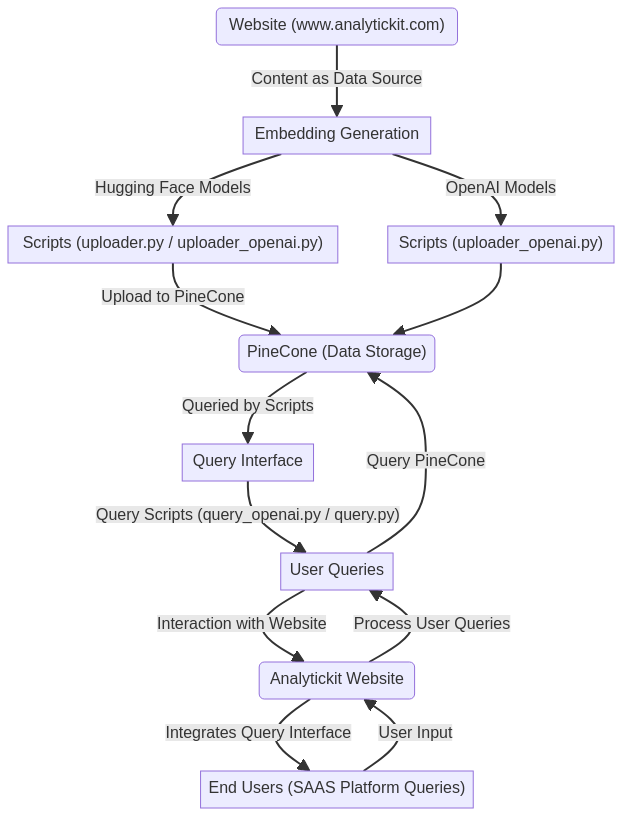

# Vector Embedding for Analytickit.com

## Overview
This repository contains a collection of programs designed to create vector embeddings for content from the website [www.analytickit.com](https://www.analytickit.com). It utilizes both Hugging Face open-source models and OpenAI models to generate embeddings. These embeddings are then uploaded to PineCone, enabling a feature on the Analytickit website where users can ask questions and receive answers about the Analytickit SAAS platform.

## Data Flow Diagram

## Contents
- `requirements.txt`: Lists all the Python dependencies required for the project.
- `uploader_openai.py`: Script to create embeddings using OpenAI models and upload them to PineCone.
- `query_openai.py`: Script to query the uploaded data using OpenAI models.
- `openai_up.py`: An alternative or supplementary script for uploading data using OpenAI models.
- `query.py`: General script for querying the uploaded embedding data.
- `uploader.py`: General script for uploading data to PineCone.
- `LICENSE`: The license file for the project.
- `.gitignore`: Specifies intentionally untracked files to ignore.

## Goal
The primary goal of this project is to enhance the user experience on the Analytickit website. By integrating these vector embeddings into the site, users can interactively ask questions and receive relevant answers about the Analytickit SAAS platform, leveraging the power of advanced AI models.

## How to Use
1. Install the required dependencies: `pip install -r requirements.txt`
2. Use `uploader_openai.py` or `uploader.py` to create and upload embeddings to PineCone.
3. Query the data using `query_openai.py` or `query.py` as needed.

## License
This project is licensed under the [LICENSE](LICENSE) included in the repository.
